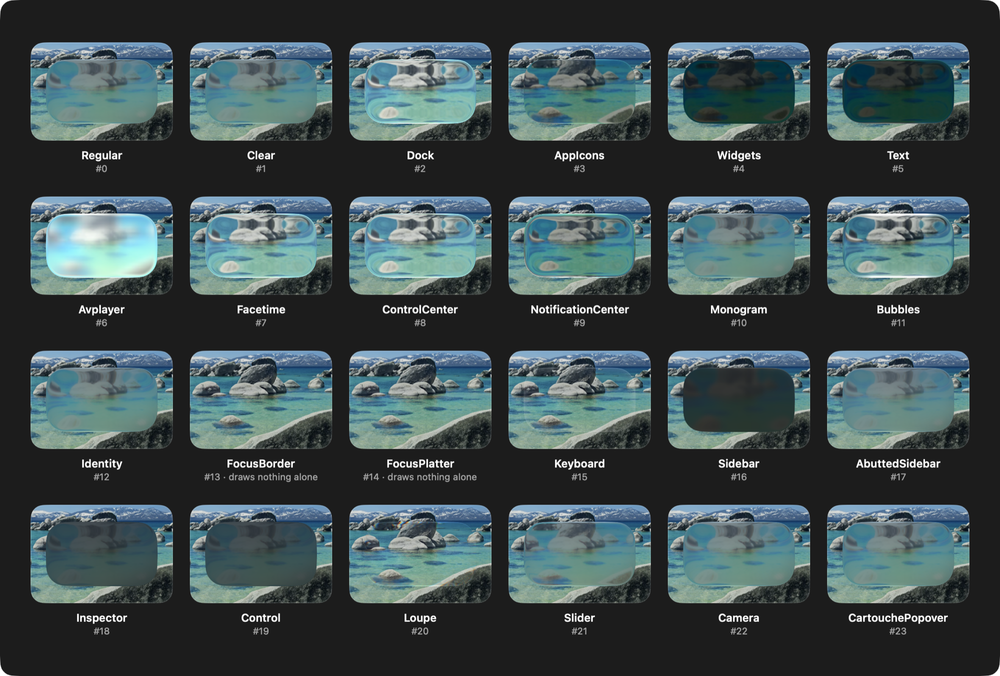

# Internals

How the private glass works, what was checked, and how to re-check it after a macOS update. Everything here was observed on **macOS 27.2** unless it says otherwise.

## What is public, what is private

`NSGlassEffectView` is public AppKit (macOS 26+). Its public properties are `contentView`, `cornerRadius`, `tintColor`, `style` (`.regular` or `.clear`) and, from macOS 27, `effectIsInteractive`. The header:

```
/Applications/Xcode.app/Contents/Developer/Platforms/MacOSX.platform/Developer/SDKs/MacOSX.sdk/System/Library/Frameworks/AppKit.framework/Headers/NSGlassEffectView.h
```

Behind `style`, the look of the glass is a *material* chosen by private properties. A **variant** is a whole preset (blur, refraction, highlights, tint). A **subvariant** is a name layered on top of it.

| Selector | Type | Used by the package | What it does |
|---|---|---|---|
| `_variant` / `set_variant:` | `NSInteger` | yes | Picks one of the 24 variants |
| `_subvariant` / `set_subvariant:` | `NSString` | yes | Picks a subvariant by name |
| `_setPath:` / `_path` | `CGPath` | yes | Gives the glass any outline, not just a rounded rectangle. Coordinates are the view's own, origin at the bottom left |
| `tintColor`, `cornerRadius`, `contentView`, `effectIsInteractive` | public | yes | Documented in the header |
| `_effectInteractiveVariantName` | `NSString` | no | Unknown; the name suggests the variant used for interactive glass |

### Other private knobs

`class_copyMethodList` on `NSGlassEffectView` shows many more. Looking at a few of them over a busy backdrop (dock, bubbles and avplayer variants, active window):

| Selector | Type | Seen |
|---|---|---|
| `_subduedState` | `NSInteger` | `1` gives the flat, frosted look that inactive windows get (clear on `dock` and `avplayer`, hardly visible on `bubbles`) |
| `_scrimState` | `NSInteger` | `1` puts a dark scrim over the glass; `0`, `2` and `3` look the same |
| `_contentLensing` | `NSInteger` | `1` changes the refraction a little; subtle |
| `_placesContentAboveGlass` | `BOOL` | No visible difference for a plain subview |
| `_adaptiveAppearance`, `_interactionState` | `NSInteger` | The test process exited before a screenshot with the values tried (`0`–`3`), probably a crash on a value out of range. Not investigated |
| `_tintOpacityReduced`, `_useReducedShadowRadius`, `_inverseMeshed` | `BOOL` | Not examined |
| `_groupIdentifier`, `_backdropGroupName` | `NSString` | Not examined |

None of these are in the package: the semantics are guesses, and a wrong value can crash. They are listed so you can try them yourself.

### Why inactive windows look flat

The glass renders flat in a window that is not key. That is driven by the window's key state, not by `_subduedState`: resetting `_subduedState` to `0` when the window resigns key did not bring the glossy look back. Variants differ in how much they change (`bubbles` hardly does, `dock` a lot), so judge them in an active window.

## The private framework

The names come from Apple's private `DesignLibrary` framework. On disk it is only a stub: the code lives in the dyld shared cache, and tools such as `dyld_info` resolve these paths from there.

```
/System/Library/PrivateFrameworks/DesignLibrary.framework
```

```
/System/Library/PrivateFrameworks/DesignLibrary.framework/DesignLibrary
```

The variants are the cases of `GlassMaterialProvider.Variant` in that framework. The subvariant names are plain strings that you only find in the shared cache (Apple silicon):

```
/System/Volumes/Preboot/Cryptexes/OS/System/Library/dyld/
```

## The 24 variants

Apple does not document these. The last column is a guess from the name, plus what was seen on screen.

| # | Variant | Name suggests |
|---|---|---|
| 0 | `regular` | standard glass; frosted grey blur, little refraction |
| 1 | `clear` | clear glass |
| 2 | `dock` | the Dock; glossy, strong refraction, goes flat in an inactive window |
| 3 | `appIcons` | app icons |
| 4 | `widgets` | widgets |
| 5 | `text` | text on glass; dark |
| 6 | `avplayer` | media player; bright, glossy, soft highlight |
| 7 | `facetime` | FaceTime |
| 8 | `controlCenter` | Control Center |
| 9 | `notificationCenter` | notifications |
| 10 | `monogram` | monogram badge |
| 11 | `bubbles` | bubble; strong bright rim and refraction |
| 12 | `identity` | identity |
| 13 | `focusBorder` | focus ring border; draws nothing on its own |
| 14 | `focusPlatter` | focus platter; draws nothing on its own |
| 15 | `keyboard` | keyboard keys |
| 16 | `sidebar` | sidebar |
| 17 | `abuttedSidebar` | sidebar that abuts the content |
| 18 | `inspector` | inspector panel |
| 19 | `control` | controls |
| 20 | `loupe` | magnifier; nearly transparent with edge distortion |
| 21 | `slider` | slider |
| 22 | `camera` | camera UI |
| 23 | `cartouchePopover` | popover (a cartouche is an ornamental frame) |



*All 24 variants, each over its own copy of the same photo crop, so only the glass differs. `FocusBorder` and `FocusPlatter` draw nothing on their own. From a demo app that is not part of this package. macOS 27.2, active window: in an inactive window the glass renders flat and most variants look alike.*

## Subvariants

A subvariant is a name (a string) layered on top of a variant. Apple's name table on macOS 27.2 has 53 names, from `default` to `homeLiveActivity`, presumably the subvariant list. `GlassSubvariant.allCases` has all of them, and any other string is accepted too.

`default` · `lockscreenControls` · `lockscreenNotifications` · `lockscreenPriorityNotifications` · `homescreenClose` · `camera` · `posterSwitcher` · `homescreenResizeHandle` · `cursorAccessory` · `transientCanvas` · `listening` · `thinking` · `response` · `spotlightField` · `searchResults` · `compose` · `homescreenFolder` · `tab` · `focusedButtonFill` · `entryField` · `volumeSlider` · `customizeSheet` · `watchFacePhotos` · `watchFacePhotosMini` · `watchFaceFlowStencil` · `watchFaceFlowSolid` · `watchPasscode` · `homescreenAppLibraryPod` · `menu` · `window` · `documentModalWindow` · `watchSmartStack` · `watchSmartStackFace` · `watchSmartStackAnimatedContent` · `siriSnippet` · `alarmSlider` · `alarmSliderRed` · `contactsQuickAction` · `mapsSign` · `mapsNavigationSign` · `sheet` · `messagesTapback` · `cluster` · `secondaryCluster` · `dock` · `appSwitcher` · `watchDetuned` · `homeModularFace` · `homeFaceFlow` · `tvPortraitClock` · `hdr` · `campoCard` · `homeLiveActivity`

Many names point at iOS and watchOS surfaces (lock screen, home screen, watch faces). Setting a known name changes the rendered glass on macOS, sometimes only slightly (checked with screenshot diffs). The setter accepts any string, so `apply` returning `true` means the call was made, not that the system recognised the name.

0.1.0 also had `.track`, which is not in the table (`tab` sits at its position). It is deprecated.

## Other things in the framework

Not used here. Most are Swift structs and enums, which the Objective-C runtime cannot call. Seen in the exported symbols: `GlassMaterialProvider` (with `Variant`, `Subvariant`, `Configuration` and `Options`), `RegularGlassMaterialProvider`, `ClearGlassMaterialProvider`, `GlassEdgeMaterialProvider`, `GlassGroupContext`, `WindowControl` (the window buttons, with their own variants), and drawing code for `Slider`, `Stepper`, `Switch`, `ProgressIndicator` and `ScrollPocket`.

## Explore it yourself

List the variant cases in declaration order. This is how the numbers in `GlassVariant` were checked:

```sh
xcrun dyld_info -exports /System/Library/PrivateFrameworks/DesignLibrary.framework/DesignLibrary | grep 'GlassMaterialProviderV7VariantO.*yA2EmFWC' | sort | sed -E 's/.*VariantO[0-9]+([A-Za-z]+)yA2EmFWC.*/\1/' | nl -v 0
```

Print the subvariant name table from the shared cache. `.05` is the piece that holds it on macOS 27.2; other builds may use another piece, and the start and end markers may move:

```sh
strings -a -n 3 /System/Volumes/Preboot/Cryptexes/OS/System/Library/dyld/dyld_shared_cache_arm64e.05 | awk 'p=="unsupported" && $0=="default"{f=1} f{print} f && $0=="homeLiveActivity"{exit} {p=$0}'
```

## After a macOS update

```swift
#if DEBUG
GlassVariantBridge.dumpVariantSelectors()   // variant-related selectors
GlassVariantBridge.dumpPrivateSelectors()   // every private selector, with type encodings
#endif
```

prints the current selectors and their type encodings. Re-run the commands above to see whether Apple added or renamed variants and subvariants. `swift test` (via Xcode's toolchain) round-trips all 24 variants and all 53 subvariant names through the real view and fails if a setter disappeared.

## Verified on

macOS 27.2, with Xcode's toolchain:

- All 24 variants are set and read back through the real view. Their names and order match the case symbols exported by `DesignLibrary.framework`. Several render clearly differently (for example `bubbles`, `avplayer`, `dock` and `loupe`); others look alike over a simple backdrop, and `focusBorder` / `focusPlatter` look empty as a plain background. Rendering also differs between an active and an inactive window.
- `set_subvariant:` takes an `NSString` on this system, so the bridge passes the name. All 53 names round-trip through the getter.
- `_setPath:` draws the glass in the shape of the path: capsule, ellipse and a five-point star were checked, and SwiftUI shapes go through it in the GlassLab demo.
- Handing the content over as `contentView` renders the same as adding it as a plain subview; the public header only guarantees the former.
