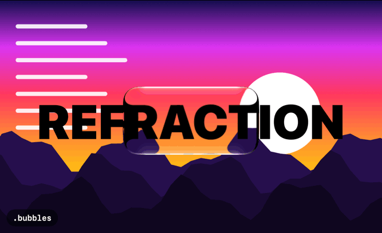
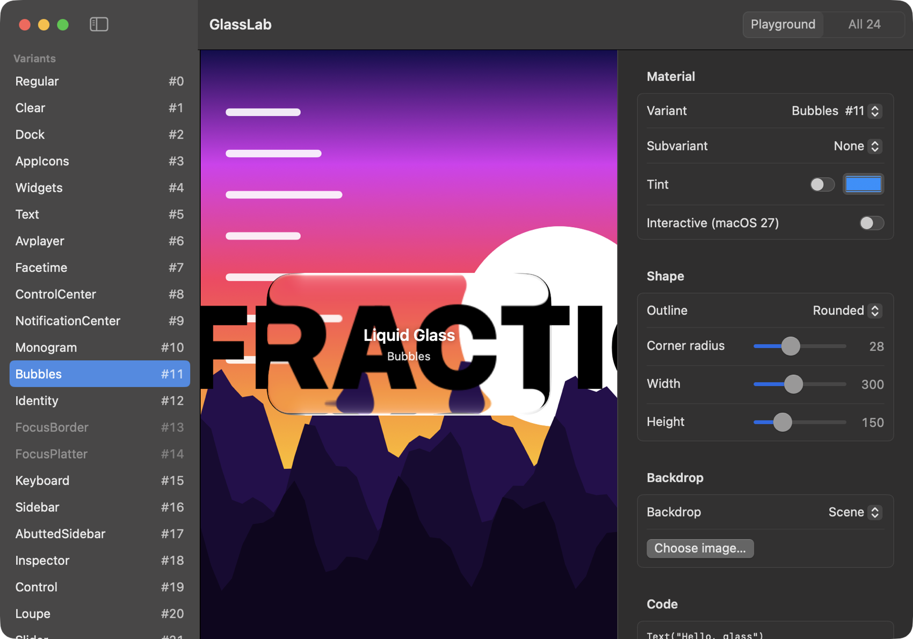

# LiquidGlassEffects



**macOS has 24 Liquid Glass materials. SwiftUI's `.glassEffect` gives you two.** This package gives you the rest, plus 53 subvariants, any `Shape`, and a playground to try them in.

[](https://github.com/HoYeonPark1221/LiquidGlassEffects/actions/workflows/ci.yml)


```swift
import LiquidGlassEffects

Text("Hello, glass")
    .padding(32)
    .privateGlassBackground(.bubbles, in: Capsule())
```

> ⚠️ **Private API.** `NSGlassEffectView` itself is public AppKit (macOS 26+), but its `_variant` / `_subvariant` / `_setPath:` are not. This package sets them through the Objective-C runtime. **Apps using it will likely be rejected from the Mac App Store.** It is meant for developer-ID / direct-distribution apps, internal tools and experiments. Apple can rename or remove these selectors in any macOS update.

## Try it

GlassLab is a playground for every variant: pick a variant and a subvariant, change the shape, tint it, drag the glass over your own image, and copy the Swift that produces it.

```sh
git clone https://github.com/HoYeonPark1221/LiquidGlassEffects.git
cd LiquidGlassEffects/Examples/GlassLab
swift run
```

Or download `GlassLab.zip` from the [Releases](https://github.com/HoYeonPark1221/LiquidGlassEffects/releases) page. It is ad-hoc signed and not notarized, so macOS blocks it on first launch: open System Settings > Privacy & Security and click Open Anyway, or run `xattr -dr com.apple.quarantine GlassLab.app` in the folder you unzipped it to.



## Install

```swift
.package(url: "https://github.com/HoYeonPark1221/LiquidGlassEffects.git", from: "0.2.0")
```

Requires macOS 13+. The real glass needs a macOS that ships `NSGlassEffectView` (macOS 26+); on anything older the same code falls back to an `NSVisualEffectView` blur.

## Usage

**A background modifier**

```swift
Text("Hello, glass")
    .padding()
    .privateGlassBackground(.avplayer, subvariant: .lockscreenControls, cornerRadius: 20)
```

**Any shape**, like `.glassEffect(in:)`. `Rectangle`, `RoundedRectangle` and `Capsule` use the glass view's own corner radius; everything else (`Circle`, your own `Shape`) goes through the private `_setPath:`.

```swift
struct Star: Shape { /* ... */ }

Color.clear
    .frame(width: 160, height: 160)
    .privateGlassBackground(.bubbles, in: Star())
```

**Tint and interactive glass**

```swift
Text("Tinted")
    .padding()
    .privateGlassBackground(.dock, in: Capsule(), tint: .blue, isInteractive: true)
```

`tint` is the public `NSGlassEffectView.tintColor`. `isInteractive` is the public `effectIsInteractive`, available from macOS 27.

**A container**

```swift
LiquidGlassBackground(variant: .bubbles, cornerRadius: 16) {
    Text("Hello, glass").padding()
}
```

The content is handed to `NSGlassEffectView.contentView`, and the container sizes itself from it.

**Any subvariant.** `GlassSubvariant` is a name, so a string works too:

```swift
.privateGlassBackground(.dock, subvariant: .menu)
.privateGlassBackground(.dock, subvariant: "someNameAppleAddsLater")
```

Glass refracts what is behind it. Over a flat colour every variant looks the same, so judge them over a colourful or detailed backdrop. `GlassVariantGalleryView()` shows all 24 side by side:

```swift
GlassVariantGalleryView()
```

## Which variants look different?

Seen over the GlassLab scene on macOS 27.2, in an active window:

| Variant | Looks like |
|---|---|
| `bubbles` | strong bright rim, magnifying refraction |
| `loupe` | nearly transparent, distorted edge: a lens |
| `dock` | glossy, tinted, strong refraction |
| `avplayer` | bright frosted glass with a soft highlight |
| `regular` | frosted grey blur, little refraction |
| `text` | dark glass |
| `focusBorder`, `focusPlatter` | draw nothing on their own |

The rest are in the [full table](Docs/Internals.md#the-24-variants) with a photo of all 24.

## FAQ

**Can I ship this in the Mac App Store?** Almost certainly not: it uses private selectors. Use it for developer-ID apps, internal tools and experiments.

**Why not just `.glassEffect`?** It offers `.regular` and `.clear`. Apple's own Dock, Control Center, sidebars and magnifier use other presets, and this is the only way to reach them from your app.

**What if Apple renames something?** Nothing crashes. See the safety model below: a missing selector is skipped, and you get the system default glass, or a blur on older macOS.

**Why does the glass look flat?** The window is not active. Glass renders flat in an inactive window, and some variants (`dock`) change a lot. Judge them in an active window.

**Does it work on iOS?** No. `NSGlassEffectView` is AppKit; iOS's `UIGlassEffect` is a different class with different knobs.

## Safety model

- Nothing is linked at compile time; the class and selectors are looked up at runtime.
- Before an IMP is called, its type encoding is checked (`NSInteger`, `BOOL`, `double`, object or `CGPath` argument, `void` return for setters). A renamed or re-typed selector is skipped instead of crashing.
- If anything is missing, calls are no-ops, getters return `nil`, and the view falls back to an `NSVisualEffectView` blur.
- `GlassVariantBridge.variant(of:)` reads the value back, so you can verify a variant actually applied.
- CI round-trips all 24 variants and 53 subvariant names through the real view on macOS 26, so a removed setter shows up as a red build.

## How it works

How the variants were found, what the other private knobs do, and how to check again after a macOS update: [Docs/Internals.md](Docs/Internals.md).

## Platform

macOS only.

## Contributing

An issue with the macOS build and the output of `GlassVariantBridge.dumpVariantSelectors()` is the most useful thing you can send after an OS update.

## Disclaimer

Unofficial project. It is not affiliated with, endorsed by, or sponsored by Apple. Apple, macOS and other Apple names belong to their respective owners.

## License

MIT
